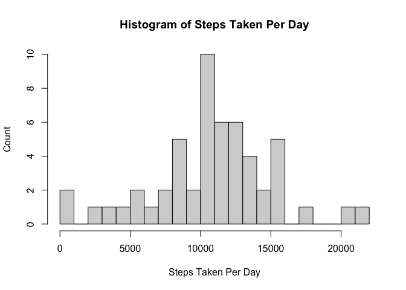

## Loading and preprocessing the data

We load the data from a CSV.


```r
activity = read.csv('activity.csv');

summary(activity)
```

```
##      steps            date              interval     
##  Min.   :  0.00   Length:17568       Min.   :   0.0  
##  1st Qu.:  0.00   Class :character   1st Qu.: 588.8  
##  Median :  0.00   Mode  :character   Median :1177.5  
##  Mean   : 37.38                      Mean   :1177.5  
##  3rd Qu.: 12.00                      3rd Qu.:1766.2  
##  Max.   :806.00                      Max.   :2355.0  
##  NA's   :2304
```

Notice a number of NA step values.
Until we start estimating the NA values, we will exclude results with NA values.


```r
activityNoNA = na.omit(activity)
```

## What is mean total number of steps taken per day?

A histogram of all values shows that zero steps were recorded on a large proportion of days. We see less than 100 steps taken per day was the largest non-NA result,


```r
hist(x=activityNoNA$steps, breaks=30,
     main='Histogram of Steps Taken Per Day',
     xlab='Steps Taken Per Day',
     ylab='Count')
```

<!-- -->

If we take out zero value days we can see the remaining counts more clearly.


```r
activityNoZeros = activityNoNA[activityNoNA$steps != 0,]
hist(x=activityNoZeros$steps, breaks=30,
     main='Histogram of Steps Taken Per Day excluding zeroes',
     xlab='Steps Taken Per Day',
     ylab='Count')
```

<!-- -->

Back to using the full non-NA data set.

We calculate the mean and median as follows.


```r
meanSteps = mean(activityNoNA$steps)
medianSteps = median(activityNoNA$steps)

cat('Mean steps: ', meanSteps, '\n')
```

```
## Mean steps:  37.3826
```

```r
cat('Median steps: ', medianSteps)
```

```
## Median steps:  0
```

## What is the average daily activity pattern?

First we determine the mean steps for each 5 minute interval, then display on a time series plot.


```r
meanStepsByInterval = aggregate(steps ~ interval, activityNoNA, mean)

library(ggplot2)
ggplot(meanStepsByInterval, aes(x=interval, y=steps)) + geom_line() +
  ggtitle("Mean Steps Per 5 Minute Interval")
```

<!-- -->

What interval contains the max number of steps on average?


```r
rowWithMaxMeanSteps = meanStepsByInterval[which.max(meanStepsByInterval$steps),]

cat('Max mean steps during interval ', rowWithMaxMeanSteps$interval, ' with ', rowWithMaxMeanSteps$steps, ' steps.')
```

```
## Max mean steps during interval  835  with  206.1698  steps.
```

## Inputting missing values

How many rows contain NAs?


```r
numRowsWithNAs = sum(!complete.cases(activity))

cat(numRowsWithNAs, ' rows with NAs')
```

```
## 2304  rows with NAs
```

Let's bring the number of NA step values to zero through estimation, by using the mean steps for that time interval across the entire series.

For this, let's continue using the `meanStepsByInterval` as calculated earlier.


```r
intervalValues <- unique(activity$interval)


# selectMeanStepsForOrderedInterval <- function(interval) {
#   indexes <- which(meanStepsByInterval$interval == interval)
#   # index <- indexes[0]
#   cat('indexes...', indexes, ', interval: ', interval)
#   # cat('meanStepsByInterval ', index, ' is ', meanStepsByInterval[index,2], '\n')
#   # meanStepsByInterval[index,2];
# }

filledActivity = activity
stepsCol <- 1
intervalCol <- 3

for(row in 1:nrow(filledActivity)){
  if(is.na(filledActivity[row,stepsCol])) {
    intervalIndex <- match(filledActivity[row,intervalCol], intervalValues)
    filledActivity[row,stepsCol] <- meanStepsByInterval[intervalIndex, 2]
  }
}
```

Let's plot a histogram of this estimated data.


```r
hist(x=filledActivity$steps, breaks=30,
     main='Histogram of Steps Taken Per Day with estimation',
     xlab='Steps Taken Per Day',
     ylab='Count (with estimation)')
```

<!-- -->

Let's filter out the zero values.


```r
filledActivityNoZeros = filledActivity[filledActivity$steps != 0,]
hist(x=filledActivityNoZeros$steps, breaks=30,
     main='Histogram of Steps Taken Per Day with estimation, no zeroes',
     xlab='Steps Taken Per Day',
     ylab='Count (with estimation)')
```

<!-- -->

Back to using the full estimated (filled-in) data set.

Let's calculate the mean and median.


```r
filledMeanSteps = mean(filledActivity$steps)
filledMedianSteps = median(filledActivity$steps)

cat('Filled mean steps: ', meanSteps, '\n')
```

```
## Filled mean steps:  37.3826
```

```r
cat('Filled median steps: ', medianSteps)
```

```
## Filled median steps:  0
```

Just to remind you once again, the original mean and medians, before filling in NA step values, were:


```r
cat('Mean steps: ', meanSteps, '\n')
```

```
## Mean steps:  37.3826
```

```r
cat('Median steps: ', medianSteps)
```

```
## Median steps:  0
```

The mean and median are the same before and after filling in missing data with the mean for that time interval.

There are however slight differences in the histograms, which are a bit more obvious when zero step results are hidden from the chart.

## Are there differences in activity patterns between weekdays and week-ends?

Let's go back to the original data set and add a column specifying whether the row was taken on a weekend or not.


```r
library(chron)
library(dplyr)
```

```
## 
## Attaching package: 'dplyr'
```

```
## The following objects are masked from 'package:stats':
## 
##     filter, lag
```

```
## The following objects are masked from 'package:base':
## 
##     intersect, setdiff, setequal, union
```

```r
activityWithWeekendCol = mutate(activity, isWeekend = is.weekend(date))
```

Now let's plot the time series plots for weekdays and weekends.


```r
weekdayActivity = activityWithWeekendCol[!activityWithWeekendCol$isWeekend,]
weekendActivity = activityWithWeekendCol[activityWithWeekendCol$isWeekend,]

meanStepsByIntervalOnWeekdays = aggregate(steps ~ interval, weekdayActivity, mean)
meanStepsByIntervalOnWeekends = aggregate(steps ~ interval, weekendActivity, mean)

weekdaysPlot <- ggplot(meanStepsByIntervalOnWeekdays, aes(x=interval, y=steps)) + geom_line() +
  ggtitle("Mean Steps Per 5 Minute Interval on Weekdays")

weekendsPlot <- ggplot(meanStepsByIntervalOnWeekends, aes(x=interval, y=steps)) + geom_line() +
  ggtitle("Mean Steps Per 5 Minute Interval on Weekends")

require(gridExtra)
```

```
## Loading required package: gridExtra
```

```
## 
## Attaching package: 'gridExtra'
```

```
## The following object is masked from 'package:dplyr':
## 
##     combine
```

```r
grid.arrange(weekendsPlot, weekdaysPlot, nrow=2)
```

<!-- -->

We notice a fairly significant difference between the weekends and weekday means. On weekdays, there was less activity from interval 1000 onwards than on weekends. Both plots do however show a lack of activity during late night/early morning hours, and a stretch of increased activity just prior to interval 1000.
